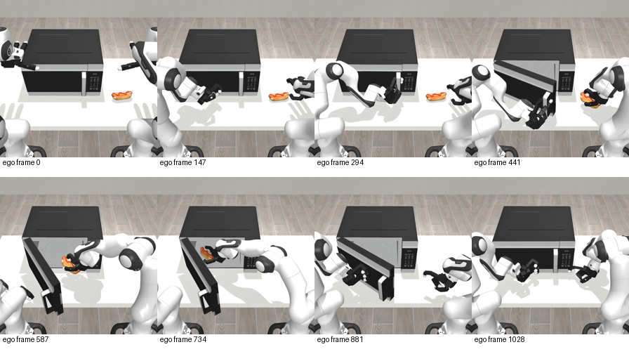

# Astra Policy on DexJoCo

Results from an Astra-written robot controller on three DexJoCo tasks: hammering a nail, watering a plant, and using a microwave with two arms.

## What was tested

Astra (`gpt-6-astra`, `xhigh`) wrote a controller that matches camera images and robot state to examples from **100 official training demonstrations per task and condition**. The code was then frozen for evaluation. Astra was not called at each control step.

**900 episodes completed:** three tasks, two randomization settings, and three seeds with 50 episodes each.

## Results

Success rate in percent, reported as the mean and sample standard deviation across three seeds.

| Task | `rand_obj` | `rand_full` |
| --- | ---: | ---: |
| Hammer Nail | $21.3\pm5.8$ | $6.7\pm4.6$ |
| Water Plant | $22.0\pm0.0$ | $22.0\pm5.3$ |
| Microwave Cook (two arms) | $2.7\pm1.2$ | $1.3\pm1.2$ |

`rand_obj` varies object placement and table height. `rand_full` also varies the camera, lighting, and table texture. The microwave task includes opening the door, placing food inside, closing the door, and pressing start.

This controller scored below all five policies in the paper's table on these six conditions. See the [full comparison](docs/comparison.md).

## Watch an example



The sequence shows the door opening, food moving inside, and the door closing. Success comes from the simulator's checks, including button contact.

Videos: [Hammer Nail](media/hammer-nail.mp4) · [Water Plant](media/water-plant.mp4) · [Microwave Cook](media/microwave.mp4). These are success examples; the scores include every accepted episode. Video playback is faster than wall-clock execution.

## Check the numbers

```sh
python3 scripts/verify_results.py
```

Uses only the Python standard library. It checks the exported episode records and recomputes the scores. The [controller source](policy/controller.py) is included for inspection; simulator reruns require the external data and evaluation setup described in [the protocol](docs/protocol.md).

## Comparison limits

Inputs, randomization, episode budgets, delay handling, and success checks follow DexJoCo. Other policies' scores are published references, not reruns on the same hardware. Earlier trials accessed test seeds, and interrupted groups were rerun in full under a fixed recovery plan. Details are disclosed in [the protocol](docs/protocol.md).

[DexJoCo](https://github.com/brave-eai/dexjoco) · [Official data](https://huggingface.co/datasets/DexJoCo/DexJoCo-Datasets-LeRobot) · [Paper, Table 2](https://arxiv.org/html/2605.16257v1#S4.T2)

MIT license for this repository's original code and documentation; see [LICENSE](LICENSE) and [NOTICE](NOTICE).
